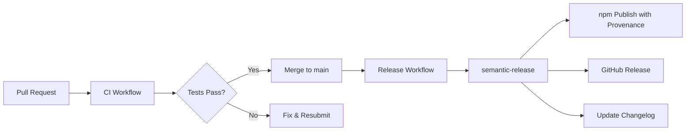
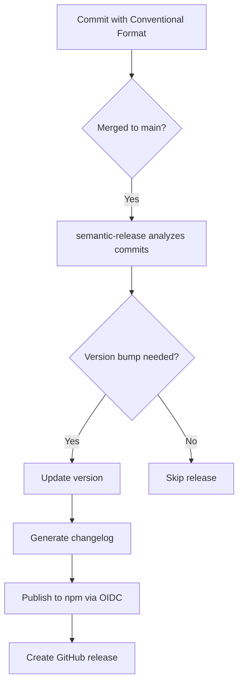

# CI/CD and Security Infrastructure Plan
## MCP Delegator - Public Release Preparation

**Version**: 1.0
**Date**: 2025-01-16
**Status**: Implementation Ready
**Package**: @littlebearapps/mcp-delegator v3.2.1 → v4.0.0 (public)

---

## Table of Contents

1. [Executive Summary](#executive-summary)
2. [Current State Analysis](#current-state-analysis)
3. [Target Architecture](#target-architecture)
4. [Implementation Phases](#implementation-phases)
5. [Documentation Structure](#documentation-structure)
6. [Quick Start Guide](#quick-start-guide)

---

## Executive Summary

This document outlines a comprehensive plan to transform **mcp-delegator** from a private development package into a production-ready, publicly released npm package with enterprise-grade CI/CD and security infrastructure.

### Key Objectives

✅ **Automated Testing**: Multi-version Node.js testing with 95%+ coverage
✅ **Security Hardening**: GitHub Advanced Security (CodeQL, Dependabot, secret scanning)
✅ **Automated Publishing**: semantic-release with npm Trusted Publisher (OIDC)
✅ **Supply Chain Security**: npm provenance attestations
✅ **Branch Protection**: Quality gates and review requirements
✅ **Public Release**: v4.0.0 with complete documentation

### Timeline

**4-week phased rollout**:
- **Week 1**: Foundation (CI, basic security)
- **Week 2**: Security hardening (GHAS, CodeQL)
- **Week 3**: Automated publishing (semantic-release, Trusted Publisher)
- **Week 4**: Public release preparation (v4.0.0)

---

## Current State Analysis

### What We Have ✅

- **Package**: `@littlebearapps/mcp-delegator@3.2.1`
- **Access**: Private (restricted to @littlebearapps org members)
- **Test Infrastructure**: Jest + ts-jest configured
- **Build System**: TypeScript compilation to dist/
- **Dependencies**:
  - Production: @modelcontextprotocol/sdk, @openai/codex-sdk, better-sqlite3, tree-kill
  - Dev: jest, ts-jest, typescript, @types/node
- **Documentation**: README, CLAUDE.md, quickrefs/

### What We Need ❌

- **CI/CD**: No automated testing or build verification
- **Security Scanning**: No CodeQL, Dependabot, or secret scanning
- **Automated Publishing**: Manual npm publish process
- **Branch Protection**: No required reviews or status checks
- **Test Coverage**: No coverage reporting or enforcement
- **Public Documentation**: Missing CONTRIBUTING.md, CODE_OF_CONDUCT.md, SECURITY.md

### Known Issues 🔧

- **Vulnerability**: js-yaml <4.1.1 (dev dependency only, no production impact)
- **Package Access**: Currently restricted, needs public configuration
- **Version Strategy**: No semantic versioning automation

---

## Target Architecture

### CI/CD Pipeline



### Security Layers

**Layer 1: Free Features (Immediate)**
- ✅ Dependency graph
- ✅ Dependabot alerts
- ✅ Dependabot security updates
- ✅ Security policy (SECURITY.md)

**Layer 2: GitHub Advanced Security (Enterprise)**
- ✅ CodeQL code scanning (JavaScript/TypeScript)
- ✅ Secret scanning with push protection
- ✅ Dependency review (PR impact analysis)
- ✅ Copilot Autofix

**Layer 3: Supply Chain Security**
- ✅ npm Trusted Publisher (OIDC)
- ✅ npm provenance attestations
- ✅ Signed commits (optional)
- ✅ Pinned Actions by SHA

### Publishing Flow



---

## Implementation Phases

### Phase 1: Foundation (Week 1) 🏗️

**Goal**: Establish baseline CI and security features

#### Tasks

1. **Create CI Workflow** (`.github/workflows/ci.yml`)
   - Run on: pull_request, push to main
   - Test matrix: Node 20.x, 22.x, latest
   - OS matrix: ubuntu-latest, macos-latest, windows-latest
   - Steps:
     - Checkout code
     - Setup Node.js with npm cache
     - Install dependencies
     - Run linting
     - Run TypeScript compilation
     - Run tests with coverage
     - Build package
     - Verify build artifacts

2. **Enable Basic Security**
   - Enable dependency graph
   - Enable Dependabot alerts
   - Configure Dependabot security updates
   - Configure Dependabot version updates
   - Create SECURITY.md policy

3. **Add Test Coverage**
   - Configure Jest coverage thresholds (95%)
   - Add coverage reporting to CI
   - Add coverage badge to README

4. **Documentation**
   - Create CONTRIBUTING.md
   - Create CODE_OF_CONDUCT.md
   - Update README with badges

#### Exit Criteria

- ✅ CI workflow runs successfully on PRs
- ✅ All tests pass
- ✅ Coverage reports generated
- ✅ Dependabot enabled and generating PRs
- ✅ Security policy published

#### Estimated Time: 8-12 hours

---

### Phase 2: Security Hardening (Week 2) 🔒

**Goal**: Enable GitHub Advanced Security features and enforce quality gates

#### Tasks

1. **Enable GHAS Features**
   - Enable CodeQL code scanning
   - Configure JavaScript/TypeScript analysis
   - Enable secret scanning
   - Enable push protection for secrets
   - Enable dependency review

2. **Create CodeQL Workflow** (`.github/workflows/codeql.yml`)
   - Schedule: Weekly + on push to main + on PRs
   - Languages: javascript, typescript
   - Query suite: security-and-quality
   - Auto-triage false positives

3. **Configure Branch Protection**
   - Protect main branch
   - Require PR reviews (minimum 1 approver)
   - Require status checks: ci/checks, codeql
   - Require conversation resolution
   - Require linear history
   - Prevent force push
   - Enforce for administrators

4. **Configure Repository Settings**
   - Enable auto-delete head branches (after PR merge)
   - Prevents repository clutter from merged feature branches
   - Reduces risk of accidental commits to old branches

5. **Security Audit**
   - Review all dependencies
   - Fix or document vulnerabilities
   - Audit GitHub Actions usage
   - Pin Actions by SHA where possible

#### Exit Criteria

- ✅ CodeQL scans complete without critical issues
- ✅ Secret scanning enabled with push protection
- ✅ Branch protection enforced on main
- ✅ All high/critical vulnerabilities addressed
- ✅ Dependabot PRs reviewed and merged

#### Estimated Time: 10-15 hours

---

### Phase 3: Automated Publishing (Week 3) 🚀

**Goal**: Implement automated versioning and publishing with npm Trusted Publisher

#### Tasks

1. **Configure npm Trusted Publisher**
   - Go to @littlebearapps/mcp-delegator settings on npm
   - Click "GitHub Actions" under "Trusted Publisher"
   - Configure:
     - Repository: littlebearapps/mcp-delegator
     - Workflow: .github/workflows/release.yml
     - Environment: (optional - can leave blank)

2. **Install semantic-release**
   ```bash
   npm install --save-dev \
     semantic-release \
     @semantic-release/changelog \
     @semantic-release/git \
     @semantic-release/npm \
     @semantic-release/github
   ```

3. **Create Release Configuration** (`.releaserc.json`)
   ```json
   {
     "branches": ["main"],
     "plugins": [
       "@semantic-release/commit-analyzer",
       "@semantic-release/release-notes-generator",
       ["@semantic-release/changelog", {
         "changelogFile": "CHANGELOG.md"
       }],
       ["@semantic-release/npm", {
         "npmPublish": true
       }],
       ["@semantic-release/github", {
         "assets": []
       }],
       ["@semantic-release/git", {
         "assets": ["CHANGELOG.md", "package.json"],
         "message": "chore(release): ${nextRelease.version} [skip ci]\n\n${nextRelease.notes}"
       }]
     ]
   }
   ```

4. **Create Release Workflow** (`.github/workflows/release.yml`)
   - Trigger: push to main (only after PR merge)
   - Permissions:
     - contents: write (create releases)
     - issues: write (comment on issues)
     - pull-requests: write (comment on PRs)
     - id-token: write (OIDC for npm)
   - Steps:
     - Checkout with fetch-depth: 0
     - Setup Node.js
     - Install dependencies
     - Run tests (verification)
     - Run semantic-release
   - **No NPM_TOKEN needed** (uses OIDC)

5. **Update package.json**
   ```json
   {
     "version": "0.0.0-development",
     "publishConfig": {
       "access": "public",
       "provenance": true
     }
   }
   ```

6. **Test Dry Run**
   ```bash
   npx semantic-release --dry-run
   ```

#### Exit Criteria

- ✅ npm Trusted Publisher configured
- ✅ semantic-release installed and configured
- ✅ Release workflow created
- ✅ Dry run succeeds
- ✅ First automated release published (test with patch)

#### Estimated Time: 6-10 hours

---

### Phase 4: Public Release (Week 4) 🌍

**Goal**: Prepare for and execute public v4.0.0 release

#### Tasks

1. **Documentation Polish**
   - Update README with:
     - CI/CD badges
     - Coverage badge
     - Version badge
     - License badge
   - Add comprehensive examples
   - Add troubleshooting guide
   - Update installation instructions
   - Document Trusted Publisher benefits

2. **Security Final Audit**
   - Run CodeQL scan
   - Review all Dependabot alerts
   - Check for secrets in git history
   - Verify no hardcoded credentials
   - Review license compliance
   - Generate SBOM

3. **Create v4.0.0 Release**
   - Create PR with BREAKING CHANGE commit:
     ```
     feat!: public release of mcp-delegator

     BREAKING CHANGE: Package is now publicly available on npm.
     This major version marks the transition from private to public release.

     - Changed package access from restricted to public
     - Added npm provenance for supply chain security
     - Enabled automated releases via semantic-release
     - Full CI/CD and security infrastructure
     ```
   - Merge PR to trigger release
   - Verify release workflow completes
   - Check npm package page for provenance badge
   - Test installation: `npm install -g @littlebearapps/mcp-delegator`

4. **Announcement**
   - Update GitHub repository description
   - Add topics/tags
   - Create announcement in GitHub Discussions
   - Update organization website

#### Exit Criteria

- ✅ All documentation complete and polished
- ✅ Security audit passed (no high/critical issues)
- ✅ v4.0.0 published to npm
- ✅ Provenance attestation visible
- ✅ Package installable globally
- ✅ Public announcement made

#### Estimated Time: 8-12 hours

---

## Documentation Structure

Comprehensive documentation organized in `/docs`:

```
docs/
├── README.md                           # Documentation index
├── ci-cd.md                           # CI/CD architecture and workflows
├── security.md                        # Security features and governance
├── release-process.md                 # Release strategy and governance
├── semantic-release.md                # semantic-release configuration
├── branch-protection.md               # Branch protection rules
├── testing-and-quality.md             # Test strategy and quality gates
├── publishing.md                      # npm Trusted Publisher setup
├── rollout-plan.md                    # Phase-by-phase implementation
├── runbooks/
│   ├── release-runbook.md            # Operational release checklist
│   └── security-incident-runbook.md  # Security incident response
└── faq.md                            # Frequently asked questions
```

**See individual documentation files for detailed implementation guidance.**

---

## Quick Start Guide

### For Maintainers

**Week 1: Get CI Running**
1. Create `.github/workflows/ci.yml` (see `docs/ci-cd.md`)
2. Enable Dependabot (see `docs/security.md`)
3. Create SECURITY.md, CONTRIBUTING.md, CODE_OF_CONDUCT.md
4. Test CI on a draft PR

**Week 2: Enable Security**
1. Request GHAS enablement (if not already)
2. Create `.github/workflows/codeql.yml` (see `docs/security.md`)
3. Configure branch protection (see `docs/branch-protection.md`)
4. Review and fix security alerts

**Week 3: Setup Publishing**
1. Configure npm Trusted Publisher (see `docs/publishing.md`)
2. Install semantic-release dependencies
3. Create `.releaserc.json` and release workflow
4. Test with dry run
5. Merge first PR to test automated release

**Week 4: Go Public**
1. Polish documentation
2. Run final security audit
3. Create v4.0.0 breaking change commit
4. Merge and verify release
5. Announce!

### For Contributors

**Before Your First PR**:
1. Read CONTRIBUTING.md
2. Use Conventional Commits format
3. Ensure tests pass locally: `npm test`
4. Check coverage: `npm test -- --coverage`

**PR Workflow**:
1. Create feature branch from main
2. Make changes with conventional commits
3. Push and open PR
4. Wait for CI checks to pass
5. Request review from maintainer
6. Address feedback
7. Merge when approved and checks pass
8. Automated release happens on merge to main

---

## Success Metrics

### Technical Metrics

- ✅ **CI Success Rate**: >95% of CI runs pass
- ✅ **Code Coverage**: ≥95% lines covered
- ✅ **Security Posture**: Zero high/critical unresolved vulnerabilities
- ✅ **Release Frequency**: Every merge to main triggers release
- ✅ **Time to Release**: <5 minutes from merge to npm publish
- ✅ **Provenance**: 100% of releases have npm provenance attestations

### Operational Metrics

- ✅ **PR Review Time**: <24 hours average
- ✅ **Dependabot PRs**: Reviewed within 7 days
- ✅ **Security Alerts**: Triaged within 48 hours
- ✅ **Documentation Coverage**: All features documented
- ✅ **Community Engagement**: Issues responded to within 48 hours

---

## Risk Assessment

### High Risk Items (Mitigation Required)

| Risk | Impact | Probability | Mitigation |
|------|--------|-------------|------------|
| Breaking change in dependency update | High | Medium | Dependabot PRs reviewed manually; tests catch issues |
| Accidental major version bump | High | Low | PR review process; conventional commit enforcement |
| CodeQL false positives | Medium | High | Custom query configuration; manual triage |
| Failed release workflow | High | Low | Dry run testing; manual release fallback |
| Secret leaked in commit | Critical | Low | Secret scanning with push protection enabled |

### Medium Risk Items (Monitor)

| Risk | Impact | Probability | Mitigation |
|------|--------|-------------|------------|
| npm Trusted Publisher downtime | Medium | Low | Wait for service restoration; no manual workaround |
| GitHub Actions outage | Medium | Low | Automated retry; manual release if prolonged |
| Test failures blocking release | Medium | Medium | Robust test suite; clear failure messages |

---

## Next Steps

1. **Review this plan** with team and stakeholders
2. **Request GHAS enablement** if not already active
3. **Schedule implementation** (4-week timeline)
4. **Assign ownership** for each phase
5. **Begin Phase 1** (Foundation)

---

## References

- [GitHub Actions Documentation](https://docs.github.com/en/actions)
- [GitHub Advanced Security](https://docs.github.com/en/get-started/learning-about-github/about-github-advanced-security)
- [semantic-release Documentation](https://semantic-release.gitbook.io/)
- [npm Trusted Publisher](https://github.blog/2023-04-19-introducing-npm-package-provenance/)
- [Conventional Commits](https://www.conventionalcommits.org/)
- [CodeQL Documentation](https://codeql.github.com/docs/)

---

**Document prepared by**: zen thinkdeep analysis
**Implementation owner**: @littlebearapps/mcp-delegator team
**Review status**: Ready for implementation
**Last updated**: 2025-01-16
